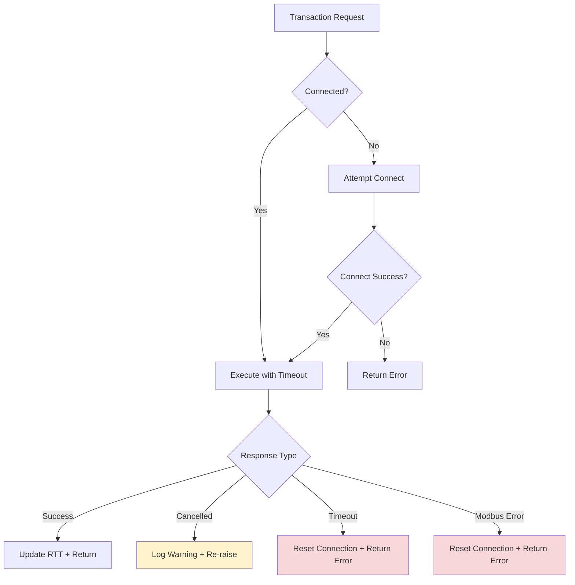
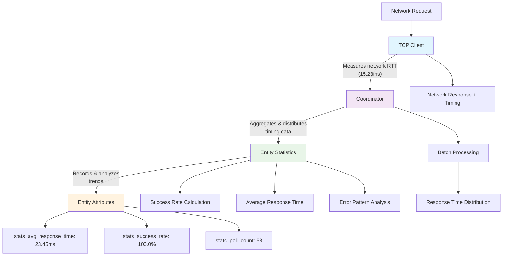
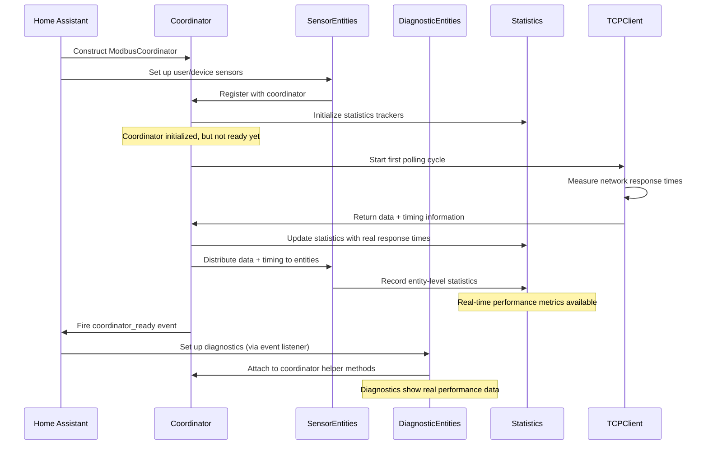

# Modbus Local Gateway Integration Architecture

## Overview

This document describes the high-level architecture of the Modbus Local Gateway custom integration for Home Assistant. It focuses on how the update coordinator, entities, mixins, statistics, and diagnostic sensors are orchestrated to ensure robust and race-free setup and operation with comprehensive performance monitoring.

---

## Initialization and Entity Setup Flow

### 1. Coordinator and Entity Creation

- On integration setup, the `ModbusCoordinator` object is constructed but **does not fire the "coordinator_ready" event immediately**.
- Sensor and other entities (for user devices) are set up and registered as normal.
- **All Modbus entity classes inherit from a shared base class (`ModbusCoordinatorEntity`), which provides:**
    - Centralized statistics tracking and response time monitoring
    - Smart attribute caching based on scan intervals
    - Consistent error handling and value change detection
    - Automatic integration with the enhanced statistics system
- Entities are added to the coordinator; batch managers and grouping are prepared, but the coordinator is not yet considered "ready" for diagnostics.

### 2. First Poll and Readiness Signaling

- The coordinator starts its first polling cycle with **integrated response time measurement**.
- **Only after the first successful poll** (i.e., the coordinator has real data and Modbus communication is confirmed), the coordinator fires the Home Assistant event: `<domain>_coordinator_ready` with payload including the `gateway_key`.
- This event is **never fired just after initialization** or after a failed poll.

### 3. Diagnostic Sensor Setup

- In the sensor platform (`sensor.py`), a listener is registered for `coordinator_ready`.
- **Diagnostic sensors are only created and added to Home Assistant after the `coordinator_ready` event is received** for the correct `gateway_key`.
- As a fallback, a delayed check ensures diagnostics are set up if the event is missed (e.g., due to a restart).

### 4. Entity and Diagnostic Attribute Behavior

- All Modbus entities (via the base class) expose a comprehensive set of extra attributes, including:
  - **Core Modbus metadata**: Register address, data type, scan interval, slave ID
  - **Real-time performance metrics**: Actual response times measured at the TCP level
  - **Statistical data**: Poll counts, success rates, value change frequencies
  - **Cache information**: Dynamic cache duration based on scan intervals
- **Response time tracking** flows from TCP client → coordinator → entity statistics:
  - TCP client measures actual network round-trip times
  - Coordinator captures and distributes timing data to entities
  - Entity statistics aggregate response times for trend analysis
- Diagnostic sensors use coordinator helper methods/properties for all runtime state and attributes.
- All dynamic and static diagnostic data is provided by the coordinator, ensuring consistency.

#### 4a. Performance Monitoring System

The integration now includes comprehensive performance monitoring at multiple levels:

**TCP Client Level:**
- Measures actual network round-trip times for each Modbus transaction
- Implements adaptive timeout mechanisms based on observed response times
- Tracks connection quality and recovery operations

**Coordinator Level:**
- Aggregates response times across batched operations
- Distributes timing information to individual entities
- Maintains overall system health metrics

**Entity Level:**
- Records individual entity response times and success rates
- Tracks value change patterns and frequencies
- Provides entity-specific optimization recommendations

#### 4b. Timestamp and Statistics Fields

The system exposes multiple categories of timing information:

**System Timestamps:**
- `last_update_success`: ISO8601 UTC time of the **last successful Modbus poll**
- `last_update_attempt`: ISO8601 UTC time of the **last poll attempt** (success or failure)

**Performance Metrics:**
- `stats_avg_response_time`: Real network response time in milliseconds (e.g., "23.45ms")
- `stats_success_rate`: Percentage of successful polls (e.g., "100.0%")
- `stats_poll_count`: Total number of poll attempts
- `stats_error_count`: Number of failed polls

**Value Change Analytics:**
- `stats_value_changes`: Number of polls that resulted in value changes
- `stats_recent_values`: Count of recently cached values
- `stats_last_value`: Most recently recorded value

**System Optimization:**
- `scan_interval`: Current polling interval (properly detected from config)
- `cache_duration`: Dynamic attribute cache duration based on scan interval

#### 4c. Transaction Management and Concurrency Control

- **Concurrency Strategy**:
  - Single lock per TCP client prevents transaction corruption
  - Cancellation handling avoids unnecessary connection resets
  - Transaction manager focuses solely on log suppression
  - Connection resets only occur on actual timeouts/errors, not cancellations

**Error Recovery Pipeline:**


## 5. Enhanced Statistics and Performance Optimization

### 5a. Integrated Statistics Tracking System

- **Each entity includes an enhanced `EntityStatisticsTracker`** that collects comprehensive polling and performance data.
- **Statistics are integrated directly into the coordinator polling loop**, eliminating separate tracking overhead.
- **Response times are measured at the TCP communication level** and flow through to entity statistics for accuracy.

Statistics trackers record:
- **Real network performance**: Actual TCP response times and connection quality
- **Poll effectiveness**: Success rates, error patterns, and recovery metrics  
- **Value change patterns**: Frequency and timing of actual data changes
- **System health indicators**: Connection stability and batch efficiency

### 5b. Smart Attribute Caching

- **Dynamic cache duration**: Cache timeout automatically adjusts based on each entity's scan interval
  - Fast polling entities (5s) → 2s cache
  - Normal entities (30s) → 10s cache  
  - Slow entities (300s) → 100s cache
- **CPU optimization**: Attributes are only regenerated when cache expires or values change
- **Automatic invalidation**: Cache is cleared when entity values change to ensure fresh statistics

### 5c. Response Time Pipeline

The response time tracking follows this integrated pipeline:


Key Features:

- Real measurements: Response times reflect actual network performance, not synthetic data
- Automatic aggregation: Multi-register reads show average response times across batched operations
- Error correlation: Failed operations are tracked with timing context when available
- Trend analysis: Statistics provide historical context for performance optimization

### 5d. Service for Scan Interval Adjustment

A new service modbus_local_gateway.set_scan_interval allows users to adjust scan intervals based on statistical recommendations.
This can be used in automations to automatically optimize polling:
```yaml
automation:
- alias: "Optimize Modbus polling"
  trigger:
    - platform: state
      entity_id: sensor.your_modbus_sensor
      attribute: polling_efficiency
      below: 30
  action:
    - service: modbus_local_gateway.set_scan_interval
      data:
        entity_id: sensor.your_modbus_sensor
        scan_interval: "{{ state_attr('sensor.your_modbus_sensor', 'recommended_scan_interval') }}
```
### 5e. Internal Operation

- Timestamps are maintained internally by the coordinator for proper operation
- Response times are captured at the lowest level (TCP client) for maximum accuracy
- Statistics updates are integrated into existing polling cycles without additional overhead
- Cache management is automatic based on scan intervals and value changes
- All timing data flows consistently from network level to user interface

### 5f. Performance Benefits

This architecture provides several key performance improvements:

- Reduced CPU usage: Smart caching minimizes attribute regeneration
- Accurate metrics: Real network timing instead of synthetic measurements
- Automatic optimization: Cache durations scale with polling frequencies
- Consistent data flow: Single pipeline from network to UI eliminates inconsistencies
- Minimal overhead: Statistics tracking integrated into existing polling operations

Key Points and Rationale

- Real performance monitoring: Response times are measured at the actual network communication level, providing accurate performance data instead of synthetic metrics.
- Integrated architecture: Statistics tracking is built into the existing polling infrastructure, eliminating additional overhead while providing comprehensive monitoring.
- Smart resource management: Dynamic cache durations and automatic invalidation optimize CPU usage while ensuring data freshness.
- Comprehensive data pipeline: Performance data flows consistently from TCP client through coordinator to entity attributes, ensuring accuracy and consistency.
- Race-free diagnostics: By deferring diagnostic sensor setup until after the first successful poll, diagnostics never appear "unavailable" on startup due to missing coordinator data.
- Coordinator as single source of truth: All diagnostic sensor state and attributes come from coordinator methods/properties, providing robust and consistent diagnostics.
- Centralized base class: The ModbusCoordinatorEntity base class ensures all entities share consistent behavior, statistics tracking, and performance monitoring.
- Automatic optimization: The system automatically adjusts cache behavior and provides real performance metrics without manual configuration.
- Robust error handling: Failed operations are tracked with timing context, providing insight into both successful and unsuccessful communication patterns.
- User-friendly metrics: Complex performance data is presented in easily understandable formats (e.g., "23.45ms", "100.0%").
- Transaction Isolation: Each transaction maintains proper ID sequencing without interference
- Graceful Cancellation: Home Assistant cancellations don't trigger unnecessary connection resets
- Error Containment: Only genuine communication failures trigger connection recovery
- Minimal Interference: Custom transaction manager limits its scope to log suppression only